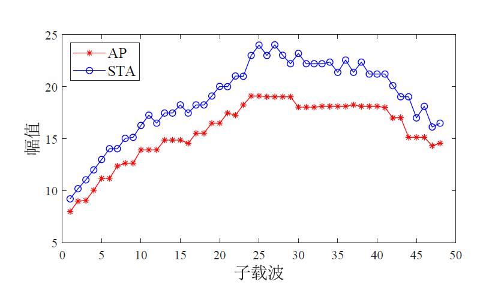
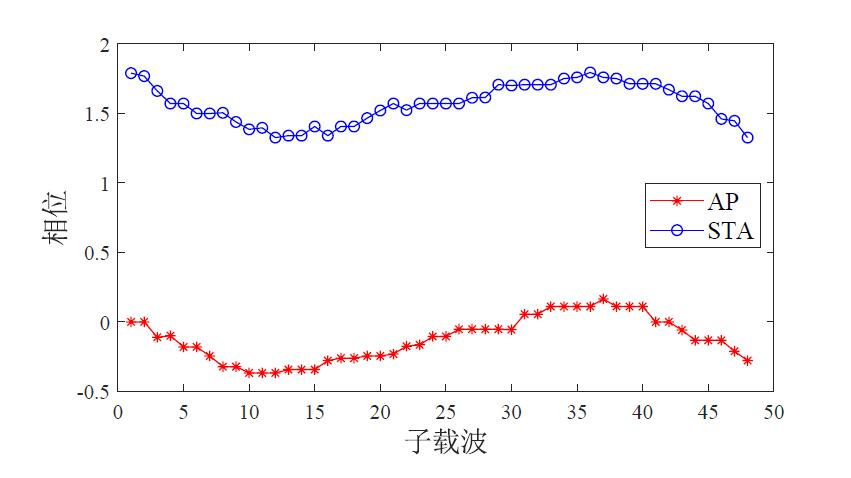
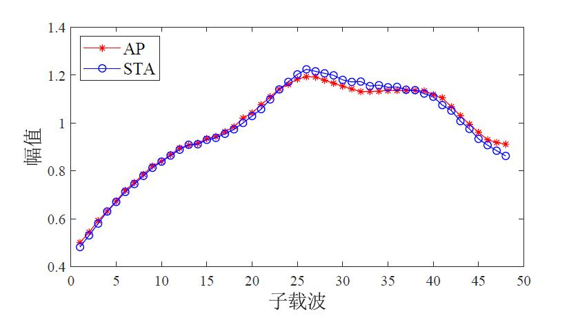
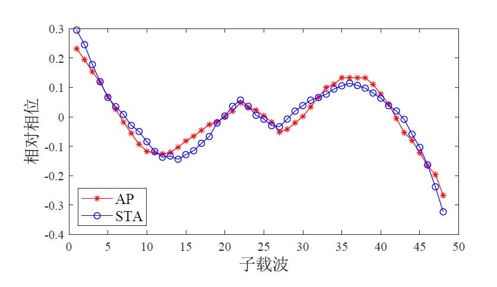

## What is it?
This is a low-cost and univeral CSI extraction tool based on ESP32, which provides the ability to extract CSI with a standalone device. The tool uses data frame and ACK frame for channel measurement, which can realize CSI extraction with high reciprocity.

## How to use?
#### 1. Flash
Before use, you should flash the application onto ESP32 chips (for AP and STA). Detailed flash environment preparation can be found in the [official documentation](https://docs.espressif.com/projects/esp-idf/en/latest/esp32/get-started/index.html). Once the environment is ready, you can flash the firmware to ESP32 using the shell script provided with the tool. The script not only provides flash functionality, but also supports saving CSI to a file.
#### 2. Use
For AP/STA, you can open the appropriate folder, and then execute the ***csi_csv_collector.sh*** script on the terminal. By the way, you should modify the path of CSI file for yourself. 

Once the script completes, AP and STA will automatically achive channel probing and extract CSI.

## CSI result
**Raw amplitude**

**Raw phase**

**Normalized amplitude**

**Relative phase**

